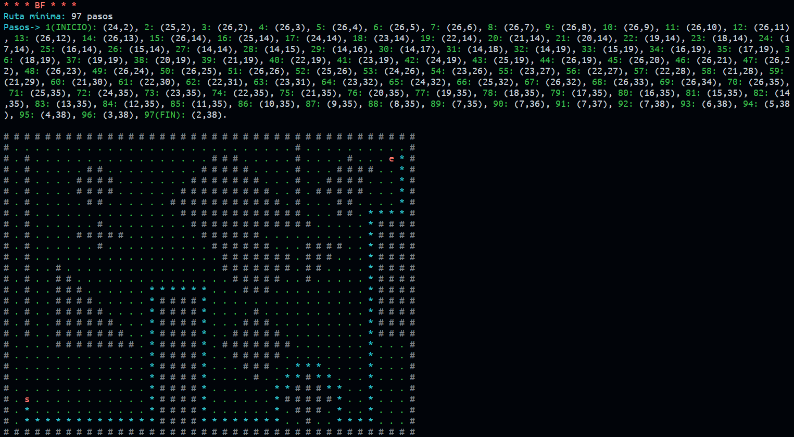

# Problema: Encontrar la ruta mínima entre dos puntos de un laberinto (BF)

Consiste en una implementación del problema del laberinto, utilizando el algoritmo
primero el mejor (BF) para la clase de Inteligencia Artificial (IA).

## Ejemplo:

