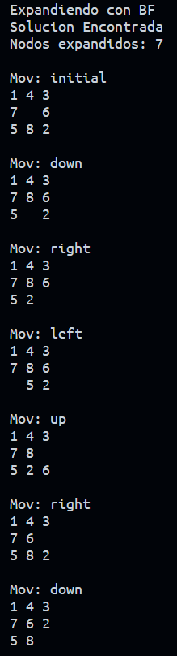
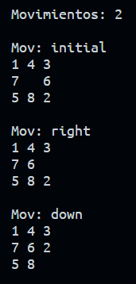

# Problema: Encontrar la solución al problema del puzzle 8 con primero el mejor (BF)

Consiste en una implementación del problema del puzzle 8, utilizando el algoritmo
primero el mejor (BF) para la clase de Inteligencia Artificial (IA).

### Expansión de nodos:

### Ruta encontrada:

